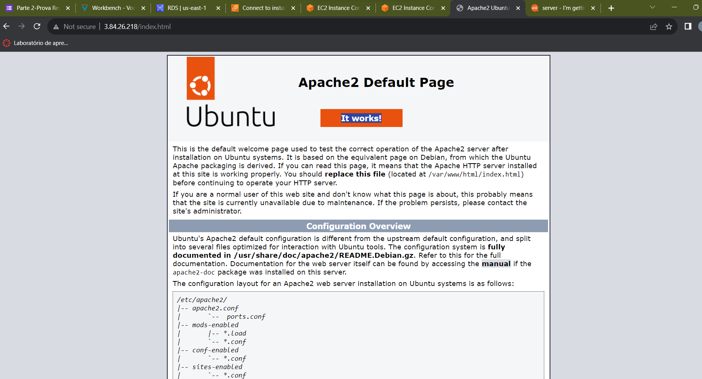
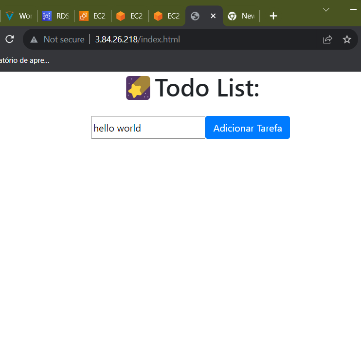
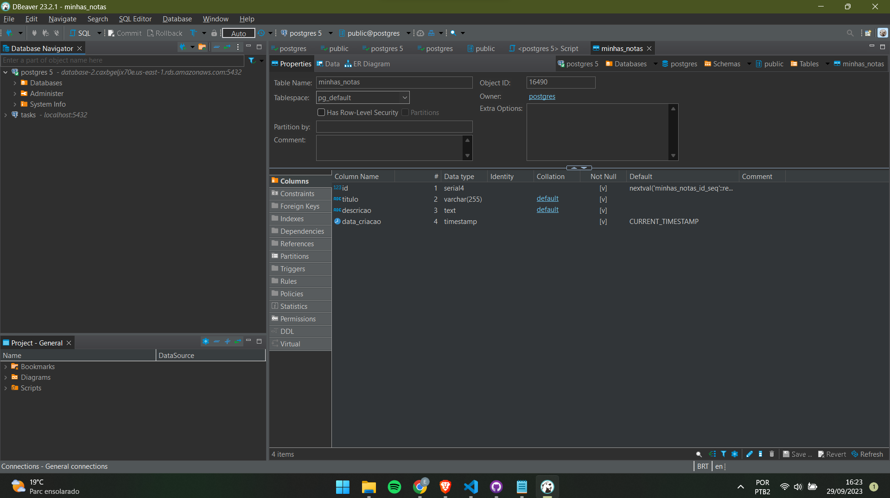
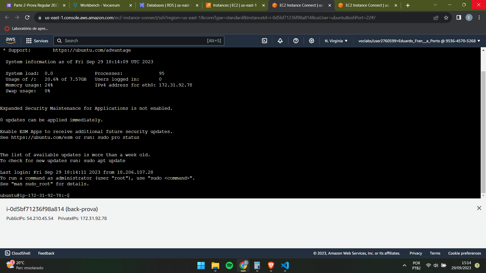
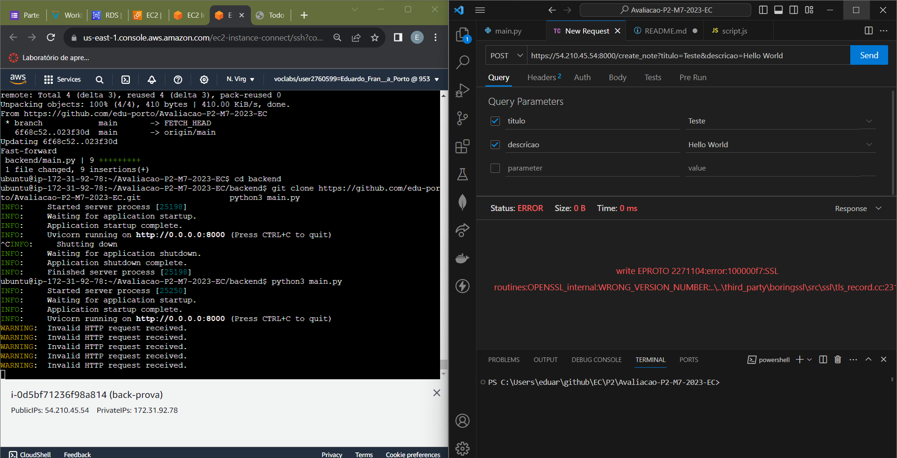

# P2 - Eduardo França Porto

Etapas

1 Criação EC2 Frontend

Primeiro de tudo eu criei uma EC2 simples com frontend e configurei ela para aceitar requisição de qualquer ip

\

\

2 Criação do RDS

O RDS foi criado com postgres e nele utilizei o user postgres e senha admin 123. O mesmo aceita requisição de qualquer ip.

\

3 Criação EC2 Backend

Aqui eu subi uma nova instância de EC2 somente para o backend e tive de ajustar algumas configurações no repositório antes de subir. As mesmas são a da RDS com o nome e senha diferentes do que vieram no repositorio padrão . Também aceita requisição de qualquer ip.

Após clonar o repositorio é só rodar o arquivo main.py

\

Após todas essas etapas eu tive um problema na api que a mesma não estava realizando o post no banco, acredito ser problema na EC2 visto que as rotas estão certas e o código da api está atualizado. Não foi possível continuar mais testes dado a falta de tempo

\
